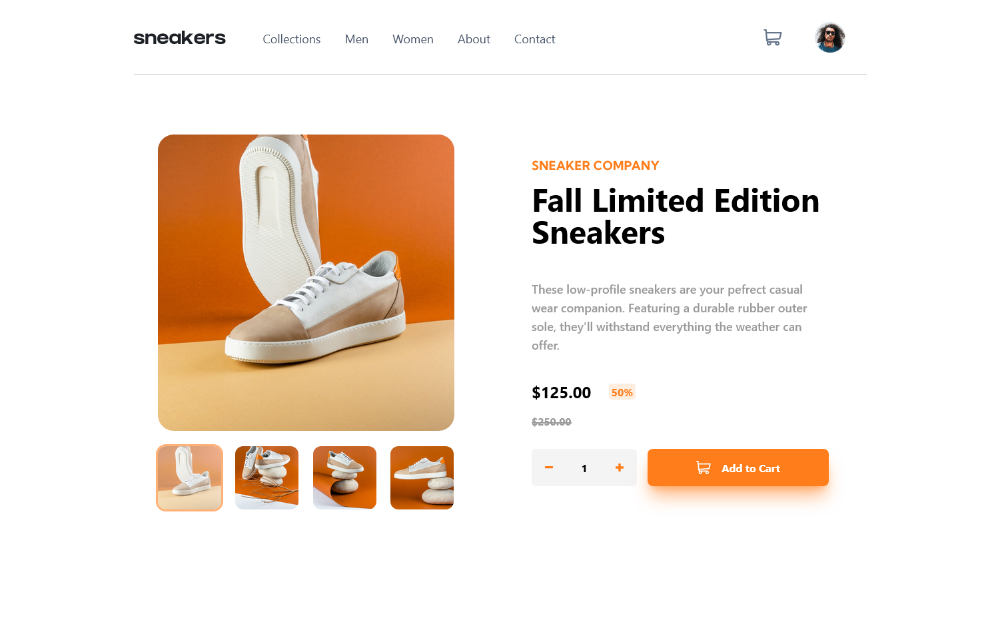

# Frontend Mentor - E-commerce product page solution

This is a solution to the [E-commerce product page challenge on Frontend Mentor](https://www.frontendmentor.io/challenges/ecommerce-product-page-UPsZ9MJp6). Frontend Mentor challenges help you improve your coding skills by building realistic projects.

## Table of contents

- [Overview](#overview)
  - [The challenge](#the-challenge)
  - [Screenshot](#screenshot)
- [My process](#my-process)
  - [Built with](#built-with)
  - [What I learned](#what-i-learned)
  - [Continued development](#continued-development)
- [Author](#author)

## Overview

### The challenge

Users should be able to:

- View the optimal layout for the site depending on their device's screen size
- See hover states for all interactive elements on the page
- Open a lightbox gallery by clicking on the large product image
- Switch the large product image by clicking on the small thumbnail images
- Add items to the cart
- View the cart and remove items from it

### Screenshot

### Links

- Solution URL: [Solution](https://www.frontendmentor.io/solutions/product-page-built-with-reactjstailwindcss-qCT7duwJbc)
- Live Site URL: [Product Page](https://cbuntrakulsuk.github.io/Product-page/)

## My process

### Built with

- Semantic HTML5 markup
- Flexbox
- CSS Grid
- Mobile-first workflow
- [Tailwindcss](https://tailwindcss.com/) - CSS framework
- [ReactJs](https://reactjs.org/) - JS library

### What I learned

This is my second project using reactJs. I used this project to learn more react and give tailwindcss a try. This was my first attempt at tailwind
and it took a while to get used to but toward the end of my project I started to see its advantages to quickly style my project. However, I dislike
having such long classes in my html, which caused a little confusion once the project started getting a little larger. I ended up learning a little more
react, specifically the useContext hook which made the cart functionality a bit easier to use instead of passing the cart though so many components.

### Continued development

I plan to continue development on this projects shopping cart functionality, currently the shopping cart only accepts the one object. I would like to add a few more
products to acutally simulate a real shopping cart experience.

## Author

- Website - [Chad Buntrakulsuk](https://github.com/cbuntrakulsuk)
- Frontend Mentor - [@cbuntrakulsuk](https://www.frontendmentor.io/profile/cbuntrakulsuk)
